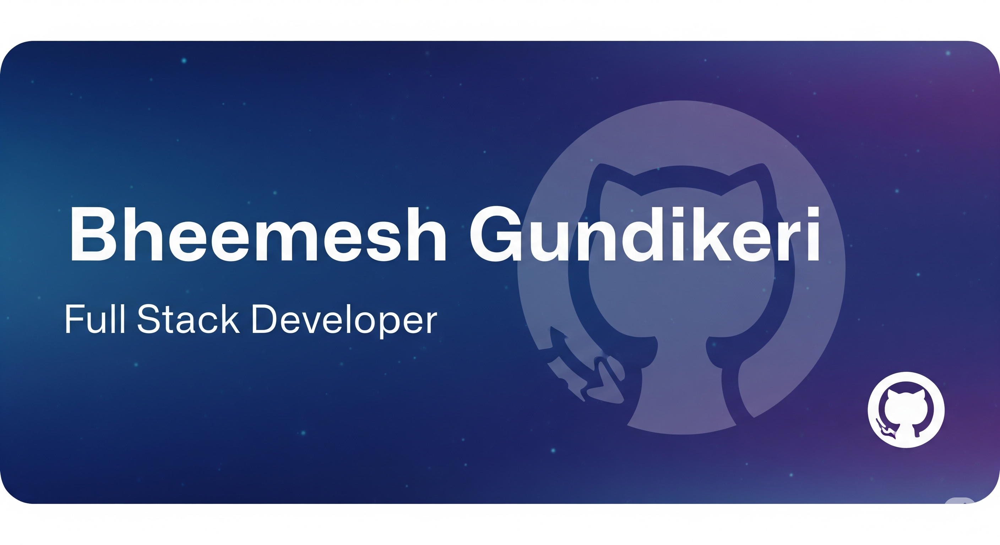

<!-- Profile Banner -->

  

<h1 align="center">Hi 👋, I'm Bheemesh Gundikeri</h1>
<h3 align="center">A passionate Software Developer</h3>

<!-- Snake Animation -->

  

---

## 🏆 GitHub Trophies

---

### 🌱 Currently Learning & Working On
- 🌱 I’m currently learning AI Skills   
- 🛠️ Working on client development project!  
- 📚 Learning Advanced SQL queries.  
- 🐍 Debugging Python scripts for ADAS.  
- 🌱 Exploring front-end development trends.  
- 💻 Developing small scale AI chat bots.
- 👨‍💻 All of my projects are available at [My Portfolio](https://bheemesh-portfolio.netlify.app/)  
- 📫 How to reach me: **bheemesh.gundikeri24@gmail.com**  

---

## 💻 Tech Stack

 <section id="skills-sphere">
    
    

</section>

---

### 📚 Useful Resources
- [PHP Documentation](https://www.php.net/docs.php)  
- [jQuery Documentation](https://api.jquery.com/)  
- [TypeScript Documentation](https://www.typescriptlang.org/docs/)

---

### 🔝 Top Contributed Repo

---

## 📊 GitHub Stats
  
  

---

### 🌐 Connect with me

---

### ✍️ Dev Quote of the Day

